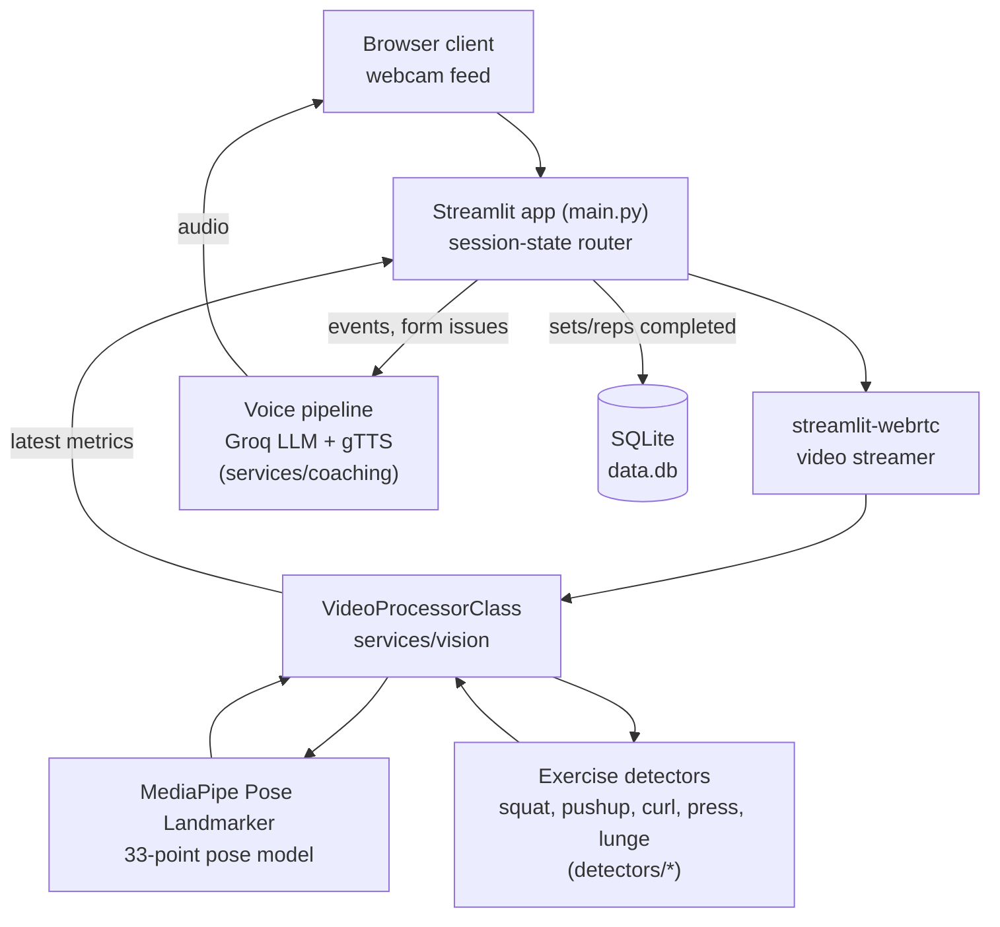
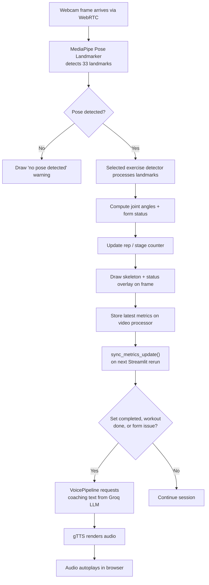
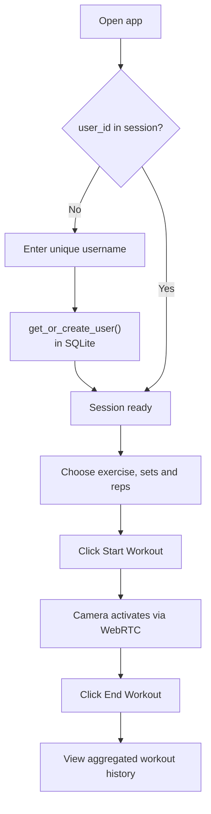
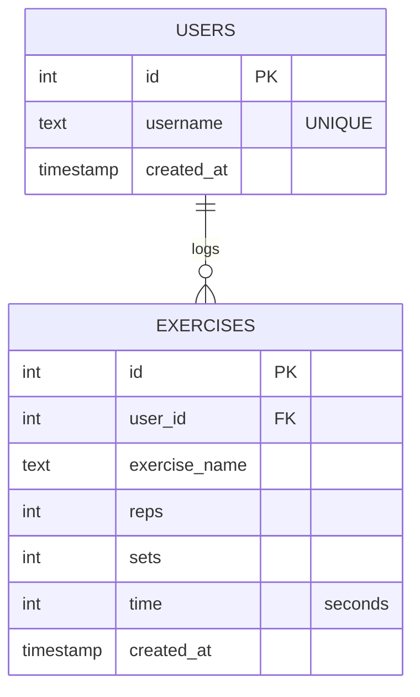

# FitPilot — AI Real-Time GYM Coach
 
FitPilot is a Streamlit app that turns a webcam into a live workout coach. It tracks body pose in real time, counts reps and grades form per exercise, and speaks short coaching cues generated by an LLM while the user trains.
 
## Architecture
 

 
The app is a single Streamlit process — there is no separate backend service. `st.session_state` holds the current login and workout state, `services/persistence/exercise_repository.py` talks to SQLite directly, and the pose model plus the five exercise detectors are created once per WebRTC connection inside `VideoProcessorClass`.
 
## Core flows
 
### Live workout session (per frame)
 

 
### Login & workout planning
 

 
### Rep counting
 
Every detector in `detectors/` extends `core.base_exercise.BaseExercise` and drives the same two-state counter off a single joint angle:
 
- Stage starts as `None` (idle) until the angle first drops below `DOWN_THRESHOLD`
- Stage flips `down → up` once the angle rises above `UP_THRESHOLD`, and a rep is only counted on that `down → up` flip
- Thresholds and the driving landmarks are exercise-specific:
  - **Squats**: knee angle, down < 100°, up > 160°
  - **Push-ups**: elbow angle, down < 90°, up > 160°
  - **Biceps Curls**: elbow angle, down (extended) > 160°, up (curled) < 50°
  - **Shoulder Press**: elbow angle, down < 90°, up > 160°
  - **Lunges**: front-knee angle, down < 100°, up > 160°
## Database schema (SQLite)
 

 
`data.db` is created and migrated automatically by `init_db()` on app startup. Each row in `exercises` is a per-day, per-exercise total for a user — `add_exercise()` upserts into today's row rather than inserting one row per set.
 
## Tech stack
 
| Layer | Technology |
|---|---|
| UI / app framework | [Streamlit](https://streamlit.io) |
| Live video | [streamlit-webrtc](https://github.com/whitphx/streamlit-webrtc) (WebRTC) |
| Pose estimation | [MediaPipe Pose Landmarker (full)](https://developers.google.com/mediapipe/solutions/vision/pose_landmarker) |
| Frame processing | OpenCV (`opencv-python-headless`), NumPy |
| Coaching LLM | [Groq API](https://groq.com) — `llama-3.3-70b-versatile` |
| Text-to-speech | [gTTS](https://pypi.org/project/gTTS/) |
| Data | SQLite (`data.db`), pandas for aggregation |
| Marketing site | Static HTML/CSS (`LandingPage/`) |
 
## Project structure
 
```
FitPilot/
├── main.py                        # Entry point — page, sidebar, camera loop, history
├── core/
│   └── base_exercise.py           # Abstract base: angle math, landmark helpers
├── detectors/                     # One rule-based detector per exercise
│   ├── squat.py
│   ├── pushup.py
│   ├── biceps_curl.py
│   ├── shoulder_press.py
│   └── lunges.py
├── services/
│   ├── auth/login_wall.py         # Username-only login gate
│   ├── config/workout_config.py   # Exercise list, pose-connection graph, metric defaults, LLM prompt
│   ├── state/session_defaults.py  # Streamlit session_state initial values
│   ├── ui/style_loader.py         # Custom CSS / font / WebRTC style injection
│   ├── vision/
│   │   └── exercise_video_processor.py  # WebRTC video processor: MediaPipe + overlays
│   ├── tracking/metrics.py        # Syncs detector output into session_state, triggers events
│   ├── coaching/
│   │   ├── llm.py                 # LLMCoach — Groq chat completion
│   │   ├── tts.py                 # TextToSpeech — gTTS
│   │   └── voice_pipeline.py      # Decides when to speak + finds form issues
│   └── persistence/
│       └── exercise_repository.py # SQLite schema + CRUD for users/exercises
├── ml_models/
│   └── pose_landmarker_full.task  # MediaPipe pose model weights
├── static/                        # App CSS + custom font
├── LandingPage/                   # Standalone marketing site (index.html, style.css)
├── tutorial-info/                 # Build-log / tutorial notes
├── data.db                        # SQLite database (created at runtime)
├── requirements.txt
├── packages.txt                   # apt packages required by OpenCV/MediaPipe on Linux
└── .streamlit/config.toml         # Theme
```
 
## Getting started
 
### Prerequisites
 
- Python 3.10+ (match your MediaPipe/OpenCV wheel availability)
- A working webcam
- A free [Groq API key](https://console.groq.com) for voice coaching — the app still runs without one, just silently
- On Linux, the system packages listed in `packages.txt` (`libgl1`, `libglib2.0-0t64`, `libsm6`, `libxext6`) for OpenCV
### Installation
 
```bash
git clone https://github.com/Divyesh-1729/FitPilot.git
cd FitPilot
 
python -m venv .venv
# Windows
.venv\Scripts\activate
# macOS / Linux
source .venv/bin/activate
 
pip install -r requirements.txt
 
# Linux only — system packages needed by OpenCV/MediaPipe
xargs sudo apt-get install -y < packages.txt
```
 
Create a `.env` file in the project root:
 
```env
GROQ_API_KEY="your_groq_api_key_here"
```
 
### Run the app
 
```bash
streamlit run main.py
```
 
Open the URL Streamlit prints (typically `http://localhost:8501`), enter a username, set your exercise/sets/reps in the sidebar, and click **Start Workout** to activate the camera.
 
### Deployment
 
The repo is set up for Streamlit Community Cloud: `requirements.txt` and `packages.txt` cover Python and apt dependencies, `.streamlit/config.toml` sets the theme, and `GROQ_API_KEY` goes in the app's **Secrets** panel instead of a local `.env` file.
 
## License
 
No license file is currently present in this repository. Consider adding one (e.g. MIT, Apache-2.0) if you intend for others to reuse the code.
 